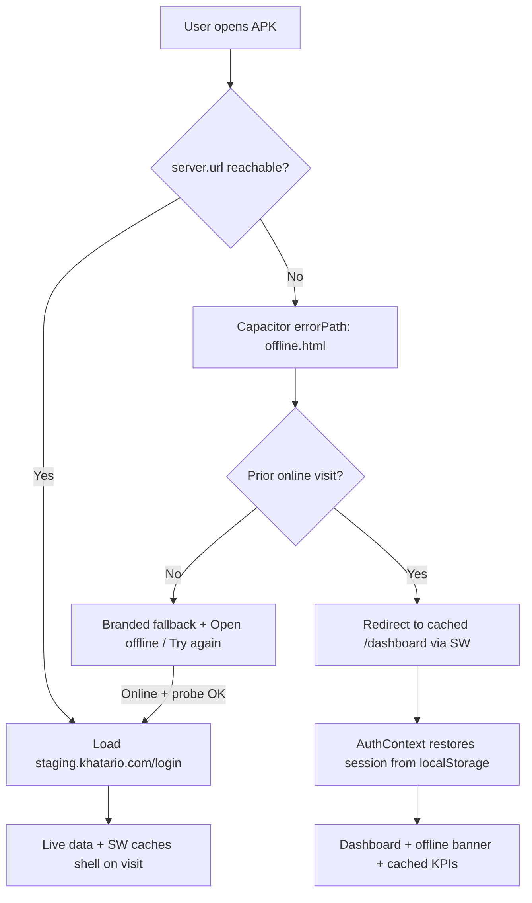

# Cold-start offline support

How Khatario handles **opening the app with no internet** on Android, web, and PWA.

---

## Problem

The Android APK loads the remote Next.js app via Capacitor `server.url`. If the device is offline on cold start, the WebView cannot reach staging/production and Android shows a raw **“Webpage not available”** error — React never mounts.

---

## Solution overview

Three layers work together:

| Layer | Where | Purpose |
|-------|--------|---------|
| **Capacitor `errorPath`** | APK assets (`capacitor-shell/offline.html`) | Branded fallback when `server.url` fails instantly |
| **Service worker** | `public/sw.js` on staging/production | Cache app shell, static assets, key routes after first online visit |
| **Client snapshots** | `localStorage` on remote origin | Dashboard overview + capability data when app is already loaded offline |

Phase 1 (`NetworkStatusBanner`) covers **runtime** offline. This document covers **cold start**.

---

## Boot flow



### Android (Capacitor)

1. WebView tries `server.url` (e.g. `https://staging.khatario.com/login`).
2. If **no connectivity**, Capacitor loads local `offline.html` from `webDir` (`capacitor-shell/`).
3. `offline.html` + `offline.js`:
   - **Cold start offline:** immediately redirect to `{origin}/dashboard?khatario_offline_bootstrap=1` so the **service worker** on the remote origin serves the cached app shell (requires one prior online sign-in + dashboard visit).
   - Show branded fallback if bootstrap cannot load (first install never online).
   - **Retry** / auto-retry on `online` event when back online.
   - Probe `/manifest.json` on server origin; redirect to `/login` when reachable.
4. User sees **dashboard + offline banner**, not a blocking gate — when cache exists.

**Note:** `errorPath` pages do **not** receive Capacitor plugin JS — logic is plain HTML/JS only. Bootstrap hands off to the remote Next.js app where Phase 1–3 offline features run.

### Web / PWA

1. Service worker registers on first visit to staging/production.
2. Navigation uses **network-first** with cache fallback.
3. Failed navigations fall back to `/offline` or cached `/dashboard`.
4. Static assets (`/_next/static/*`, fonts, icons) use **cache-first**.

---

## Cache strategy

### Service worker (`public/sw.js`)

| Request type | Strategy |
|--------------|----------|
| `/api/*` | Network only (never cached) |
| `/_next/static/*` | Cache-first |
| `/icons/*`, fonts, `manifest.json` | Cache-first |
| HTML navigation | Network-first → pathname match → `/dashboard` → `/login` → `/offline` |

Cache names: `khatario-shell-v2-*` (version bump in `sw.js` when strategy changes).

**Important:** `/dashboard` is **not** install-precached (middleware would store a login redirect). It is cached on first authenticated visit while online.

### Client snapshots (remote origin `localStorage`)

| Key pattern | Content | TTL |
|-------------|---------|-----|
| `offline_capability_{businessId}_{userId}` | Permissions, plan, features | 24h soft TTL (used even if expired when offline) |
| `offline_dashboard_{businessId}_{userId}_{dateRange}` | Dashboard overview KPIs | Until next successful fetch |
| `khatario_last_sync_at` | Global last sync timestamp | Updated on successful dashboard/capability fetch |

---

## Capacitor integration

### Config (`capacitor.config.ts`)

```ts
server: {
  url: resolveCapacitorServerUrl(process.env.CAP_SERVER_URL),
  errorPath: 'offline.html',
}
```

### Build pipeline

```bash
npm run cap:android:staging:install
```

Steps:

1. `scripts/write-capacitor-shell-config.mjs` → `capacitor-shell/config.json` (`serverUrl` + `bootstrapUrl`)
2. `npx cap sync android` → copies shell + config into APK assets
3. Verifies `server.url` and `server.errorPath` in generated `capacitor.config.json`

### Shell version

Native shell metadata in `plugins.KhatarioShell` — bump `versionCode` when changing errorPath, plugins, or permissions. Current: **1.2.1 (4)**.

---

## Authentication offline

- **httpOnly JWT cookies** live in the WebView cookie jar for the remote origin.
- **AuthContext** mirrors session to `localStorage` (`user`, `business`, permissions, …).
- On server unreachable during session check, AuthContext **keeps cached session** (does not logout).
- Token refresh requires network — defer validation until reconnect.
- **errorPath page** cannot read remote `localStorage`; copy explains session resumes after reconnect.

---

## Stale-data UI

When offline with cached data:

- **NetworkStatusBanner**: “No internet connection” + “Showing last synced data · X ago”
- Timestamp from `khatario_last_sync_at` and capability snapshot

---

## Reconnect recovery

1. `NetworkStatusProvider` detects online (browser + `@capacitor/network`).
2. Dispatches `khatario:network-reconnect`.
3. `LayoutDataContext` refetches subscription, notifications, badges, warehouses.
4. Dashboard bumps refresh key → refetches overview, updates snapshots.
5. Offline banner hides automatically.

---

## Limitations

| Limitation | Detail |
|------------|--------|
| First install offline | No cached remote data; user sees branded offline screen only |
| errorPath has no Capacitor plugins | Cannot use Bluetooth, native share, etc. on offline page |
| SW requires prior online visit | Cold-start PWA offline needs at least one successful load |
| API writes offline | Not supported; server remains source of truth |
| Dashboard widgets | Only overview KPIs cached; customizable widgets may be empty offline |
| Server errors (5xx) | May take longer before `errorPath` vs instant no-network |

---

## Future improvements

- **IndexedDB** for larger offline datasets (invoices list, items)
- **Background sync** when `@capacitor/background-runner` or SW sync is viable
- **Full static export** into `webDir` for true offline-first without remote URL
- **Capacitor Preferences** bridge to share auth hints with errorPath page
- **Serwist / Workbox** build-time precache from Next.js build output

---

## Testing

### Android cold start (requires new APK)

1. Build: `npm run cap:android:staging:install`
2. Open app **online** once → login → visit dashboard (seeds caches)
3. Enable airplane mode
4. Force-stop app → reopen
5. **Expect:** Brief shell screen, then **cached dashboard** with offline banner (not blocking gate)
6. If never opened online: fallback with **Open Khatario (offline)** + explanation
7. Disable airplane mode → tap **Try again** → app loads staging login

### Runtime offline (server deploy only)

1. Deploy Phase 1 + 2 server changes to staging
2. Open dashboard online
3. Toggle airplane mode
4. **Expect:** Amber banner, dashboard KPIs remain, stale timestamp

### PWA / Chrome

1. Visit `https://staging.khatario.com` twice (SW install)
2. DevTools → Application → Service Workers → confirm active
3. Offline checkbox → reload or navigate
4. **Expect:** Cached shell or `/offline` page

### Clear caches

- Web: `public/clear-cache.html` or DevTools → Clear site data
- App: Settings → Apps → Khatario → Clear storage

---

## Related docs

- `docs/SERVER_INFRASTRUCTURE.md` — deploy & APK build scripts
- `docs/PWA_SETUP.md` — PWA manifest & icons
- Phase 1: `NetworkStatusProvider`, `NetworkStatusBanner`
