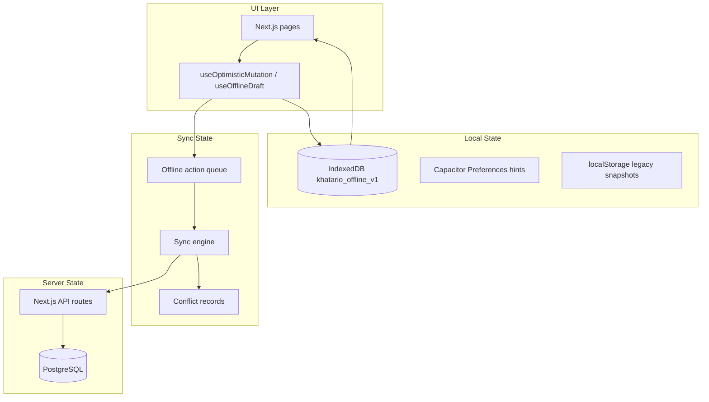

# Offline-first architecture (Phase 3)

Transform Khatario from a remote WebView shell into a **resilient offline-capable business platform**.

**Related:** Phase 1 (`NetworkStatusBanner`), Phase 2 (`docs/COLD_START_OFFLINE.md`).

---

## Goals

| Principle | Implementation |
|-----------|----------------|
| UI always opens | Capacitor `errorPath` + SW shell cache + IDB local state |
| Data never feels lost | Durable queue + form drafts + entity cache |
| Actions queue offline | `OfflineActionQueue` with ordering + idempotency |
| Sync reconciles automatically | `SyncEngine` on reconnect + periodic retry |

---

## Three-layer state model



### Separation of concerns

| Layer | Owns | Must not |
|-------|------|----------|
| **Local** | Cached reads, drafts, optimistic patches | Finalize GST documents silently |
| **Sync** | Queue order, retries, dedup keys | Business rule validation |
| **Server** | Authoritative books, GST, stock locks | Assume client is online |

---

## Folder structure

```
lib/offline/
├── types.ts
├── storage/          # IndexedDB + Preferences
├── repositories/     # Entity cache, drafts, sync meta
├── queue/            # Durable FIFO queue
├── sync/             # Engine, conflicts, retry, executors
├── connectivity/     # State machine
├── observability/    # Logs + metrics
└── migration/        # Phase 1/2 → IDB

contexts/OfflineSyncContext.tsx
lib/offline-sync/          # Phase 3b server idempotency + replay executors
├── types.ts
├── replay-log-repository.ts
├── with-idempotent-replay.ts
└── execute-purchase-finalize-replay.ts

hooks/useOptimisticMutation.ts
hooks/useOfflineDraft.ts
components/system/SyncStatusBanner.tsx
app/api/offline-sync/replay/route.ts
app/api/offline-sync/history/route.ts
app/(app)/settings/offline-sync/page.tsx
database/migrations/242_offline_replay_log.sql
database/migrations/243_offline_replay_duplicate_metric.sql
```

---

## IndexedDB schema

| Store | Contents |
|-------|----------|
| `entities` | Dashboard KPIs, invoices, customers, suppliers, stock |
| `actions` | Offline mutation queue |
| `drafts` | Purchase/sales form drafts |
| `sync_meta` | Last sync, queue counts |
| `conflicts` | Manual-review records |
| `logs` | Sync observability (500 cap) |

---

## Offline action queue

### Action types

`purchase.finalize` (shipped), `sales.create`, `sales.update`, `purchase.create`, `purchase.update`, `stock.adjust`, `payment.record`

### Guarantees

1. Monotonic **sequence** per tenant (FIFO)
2. **idempotencyKey** on every action
3. Status: `pending` → `syncing` → `completed` | `failed` | `manual_review`
4. Exponential backoff, max 8 retries (poison queue after cap)
5. Failed / manual-review actions retained with `lastError`

### GST-safe conflict defaults

| Action | Strategy |
|--------|----------|
| purchase.finalize, sales/purchase/payment | `manual_review` |
| stock.adjust | `server_wins` |

---

## Server replay registry (Phase 3b)

PostgreSQL table `offline_replay_log` (tenant = `business_id`):

| Column | Purpose |
|--------|---------|
| `idempotency_key` | UNIQUE per business — client dedup |
| `request_hash` | SHA-256 of payload — tamper detection |
| `status` | `pending` → `processing` → `completed` \| `failed` \| `manual_review` |
| `response_payload` | Immutable completed result (never mutated) |
| `duplicate_prevented_count` | Idempotency hits without re-execution |

### `withIdempotentReplay()`

1. `INSERT … ON CONFLICT DO NOTHING` + `SELECT … FOR UPDATE`
2. **completed** → return stored response (`duplicate`)
3. **processing** (fresh) → reject concurrent execution
4. **processing** (stale >5m) → reclaim after crash
5. **failed** → retry if attempts < 8
6. **hash mismatch** → `manual_review` (never auto-merge)
7. Execute handler in same transaction → mark completed atomically

### Replay API contract

`POST /api/offline-sync/replay` returns:

```ts
{
  success: boolean;
  replay_status: 'completed' | 'duplicate' | 'manual_review' | 'failed';
  idempotency_key: string;
  entity_type?: string;
  entity_id?: string;
  diagnostics?: { replay_attempts; duplicate_detected?; gst_conflict?; duration_ms? };
}
```

### `purchase.finalize` executor

Uses `createPurchaseInTransaction()` — same path as `POST /api/purchases` with `status: 'final'`. Pre-replay GST validation via `validatePurchaseGstPayload()`; mismatch → `manual_review`.

### `sales.finalize` executor

Uses `createInvoiceInTransaction()` — branch `FOR UPDATE` numbering, stock deduction, customer balance, ledger. Client TMP reference stored in `offline_invoice_number_map`; legal `invoice_number` assigned only on server.

---

## Offline invoice numbering (Phase 3c)

| Phase | Number shown |
|-------|----------------|
| Offline (POS) | `TMP-{DEVICE}-{SEQ}` e.g. `TMP-A1B2C3D4-1002` |
| After sync | Branch series e.g. `INV-042` |

Mapping is permanent in `offline_invoice_number_map` for audit and reprints.

---

## Sync lifecycle

1. User action offline → optimistic UI patch + `enqueue`
2. Reconnect → `runSyncEngine`
3. FIFO replay → `POST /api/offline-sync/replay` with `X-Idempotency-Key`
4. **completed/duplicate** → mark local action completed
5. **manual_review** (409) → queue stays visible with warning; no auto-merge
6. Transient error → exponential retry; validation → permanent failed

---

## Connectivity states

`online` | `degraded` | `offline` | `reconnecting` | `syncing`

---

## Implementation roadmap

### Phase 3a (foundation — shipped)

IndexedDB, queue, sync engine, connectivity UX, dashboard IDB cache, replay stub, debug page.

### Phase 3b (server idempotency — shipped)

- `offline_replay_log` migration + `withIdempotentReplay()`
- `purchase.finalize` replay via existing purchase service
- Offline purchase form enqueue
- `/settings/offline-sync` server history + metrics
- GST mismatch → manual review

### Phase 3c (offline sales invoicing — shipped)

- `sales.finalize` replay via `createInvoiceInTransaction()`
- Temporary offline numbers (`TMP-{device}-{seq}`) → server legal number on sync
- `offline_invoice_number_map` audit table
- Local stock reservation + customer balance optimism
- POS offline print with TMP number + sync badge
- Action priority ordering (purchase → sales → payment)

### Phase 3d (next)

Manual review resolution UI, batch/serial replay hardening, Redis multi-instance lock, Capacitor SQLite entity cache, full E2E offline billing tests.

---

## Libraries

| Need | Choice |
|------|--------|
| IndexedDB | `idb` |
| Mobile hints | `@capacitor/preferences` |
| Pattern | Outbox + idempotent replay |
| Large offline DB | `@capacitor-community/sqlite` (later) |

---

## Testing

```bash
npx jest tests/lib/offline tests/lib/offline-sync --no-cache
```

Manual: `/settings/offline-sync`, toggle airplane mode, finalize purchase offline, verify replay on reconnect.

---

## Accounting safety rules (Phase 3b)

1. Never auto-merge GST conflicts
2. Never create duplicate purchases (idempotency key + replay log)
3. Never replay stock twice (single transaction + completed short-circuit)
4. Never mutate completed replay payloads
5. Preserve client timestamps in purchase payload where provided
6. GST validation failures → `manual_review`, not silent correction

---

## Limitations

- **sales.finalize** and **purchase.finalize** have server replay executors; `sales.create`/`payment.record` still return 422
- Run migrations **242–244** on staging/production before deploy
- Batch/serial stock allocation during replay uses simplified path — complex cases may route to manual review
- Multi-instance VPS: PostgreSQL row locks suffice for single DB; Redis lock optional for Phase 3d
