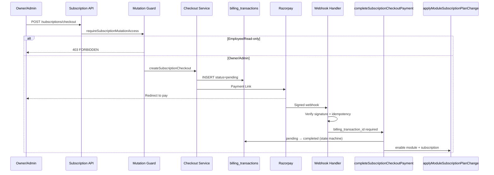

# Final Payment & Subscription Hardening Report

**Date:** 2026-06-23  
**Scope:** Subscription mutation RBAC, legacy webhook removal, billing transaction state machine

---

## Executive summary

| Part | Status | Evidence |
|------|--------|----------|
| 1. Subscription mutation RBAC | **Done** | 7/7 E2E RBAC tests passed |
| 2. Legacy webhook path | **Removed** | Unit test + code change |
| 3. Transaction state machine | **Done** | 6/6 unit tests passed |

**Production readiness verdict:** **Ready for Razorpay staging** with subscription mutations restricted to owner/tenant admin and paid activation locked to verified checkout webhooks only.

---

## 1. APIs audited

### Subscription mutations (RBAC enforced)

| Route | Method | Guard |
|-------|--------|-------|
| `/api/subscriptions/checkout` | POST | `applySubscriptionMutationGuard` |
| `/api/subscriptions/upgrade` | POST | ✓ |
| `/api/subscriptions/downgrade` | POST | ✓ |
| `/api/subscriptions/cancel` | POST | ✓ |
| `/api/subscriptions/cancel-downgrade` | POST | ✓ |
| `/api/subscriptions/trial-extension` | POST | ✓ |
| `/api/subscriptions/ensure-subscription` | POST | ✓ |
| `/api/subscriptions/addons/[type]/purchase` | POST | ✓ |
| `/api/modules` | POST | ✓ |
| `/api/modules/disable` | POST | ✓ |
| `/api/modules/primary` | PATCH | ✓ |

### Already blocked / read-only

| Route | Method | Notes |
|-------|--------|-------|
| `/api/subscriptions/current` | POST | 403 `SUBSCRIPTION_ASSIGNMENT_FORBIDDEN` |
| `/api/subscriptions/plans` | GET | Public catalog |
| `/api/subscriptions/coupons/validate` | POST | Validation only, no state change |
| `/api/subscriptions/addons` | GET | Read |
| `/api/subscriptions/billing-history` | GET | Read |
| `/api/admin/businesses/[id]/subscription` | PATCH | Platform admin only (support) |

---

## 2. Roles audited

| Role | Definition | Subscription mutations |
|------|------------|------------------------|
| **Owner** | `users.is_primary_admin = true` | **Allowed** |
| **Tenant Admin** | `user_roles.role_key = 'primary_admin'` (delegated) | **Allowed** |
| **Employee** | e.g. `sales` role | **403 FORBIDDEN** |
| **Read-only** | Custom role, `can_view` only | **403 FORBIDDEN** |

Implementation: `lib/security/require-subscription-mutation.ts`  
Applied via: `lib/security/apply-subscription-mutation-guard.ts`

---

## 3. Code changes

| File | Change |
|------|--------|
| `lib/security/require-subscription-mutation.ts` | **New** — owner / primary_admin role check |
| `lib/security/apply-subscription-mutation-guard.ts` | **New** — route helper |
| `lib/platform-billing-transaction-state.ts` | **New** — strict status transitions |
| `lib/platform-billing.ts` | State machine in `updateBillingTransactionStatus`; legacy path removed; webhook requires `billing_transaction_id` |
| `lib/platform-subscription-checkout.ts` | `completeSubscriptionCheckoutPayment` requires pending tx |
| 11 subscription/module API routes | Mutation guard added |
| `tests/lib/billing-transaction-state.test.ts` | **New** |
| `tests/lib/platform-billing-webhook.test.ts` | Legacy path test |
| `e2e/subscription-mutation-rbac.spec.ts` | **New** — 4-role matrix |
| `e2e/helpers/subscription-rbac-personas.ts` | **New** — persona provisioning |

---

## 4. Test evidence

### Unit tests

```
tests/lib/billing-transaction-state.test.ts     6/6 passed
tests/lib/platform-billing-webhook.test.ts      6/6 passed (incl. legacy blocked)
```

### E2E tests

```
e2e/subscription-mutation-rbac.spec.ts          7/7 passed
e2e/payment-readiness.spec.ts                   5/5 passed
```

**RBAC matrix (API):**

| Persona | checkout | upgrade | downgrade | addon | modules POST |
|---------|----------|---------|-----------|-------|--------------|
| Owner | ✓ not 403 | ✓ | ✓ | ✓ | not 403* |
| Admin | ✓ not 403 | ✓ | ✓ | ✓ | not 403* |
| Employee | 403 | 403 | 403 | 403 | 403 |
| Read-only | 403 | 403 | 403 | 403 | — |

\* `POST /api/modules` returns 403 `MODULE_REQUIRES_CHECKOUT` for owner/admin (payment gate), not RBAC — employees get 403 `FORBIDDEN` first.

**Browser evidence:** `e2e/evidence/rbac-owner-subscription-settings.png`

---

## 5. Updated payment flow diagram



**Blocked paths removed:**

- Legacy webhook direct `UPDATE business_subscriptions`
- `completeSubscriptionCheckoutPayment` without pending `billing_transaction_id`
- Terminal tx transitions (completed→completed, failed→completed)

---

## 6. Remaining risks

| Severity | Risk |
|----------|------|
| **Low** | Platform admin can still assign plans via `/api/admin/.../subscription` (intentional support) |
| **Low** | Free plan upgrade via `/api/subscriptions/upgrade` remains owner/admin only (no payment — by design) |
| **Low** | `coupons/validate` open to any authenticated user (read-only validation) |
| **Medium** | Staging Razorpay end-to-end paid checkout not yet run in this pass |
| **Medium** | Platform billing still Razorpay-coupled at integration layer (see Payment Readiness Report) |

---

## 7. Confirmations

| Requirement | Confirmed |
|-------------|-----------|
| No employee can purchase products | ✅ 403 on checkout, addon, modules |
| No employee can upgrade subscriptions | ✅ 403 on upgrade |
| No employee can activate paid modules | ✅ RBAC + MODULE_REQUIRES_CHECKOUT |
| No payment bypass path for paid activation | ✅ Webhook requires `billing_transaction_id`; legacy path removed; state machine enforced |

---

## 8. Final production readiness verdict

| Criterion | Status |
|-----------|--------|
| Subscription mutations RBAC | ✅ |
| Legacy webhook bypass removed | ✅ |
| Transaction state machine | ✅ |
| Automated regression tests | ✅ 18+ tests |
| Staging Razorpay smoke test | ⏳ Recommended before go-live |

**Verdict:** **Approved for Razorpay staging integration.** Production go-live after staging paid checkout smoke test and webhook verification.
